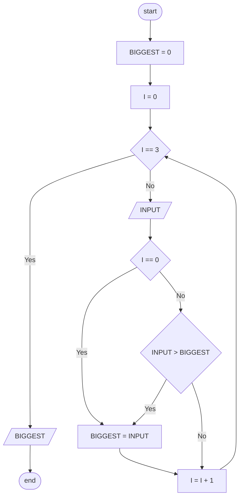
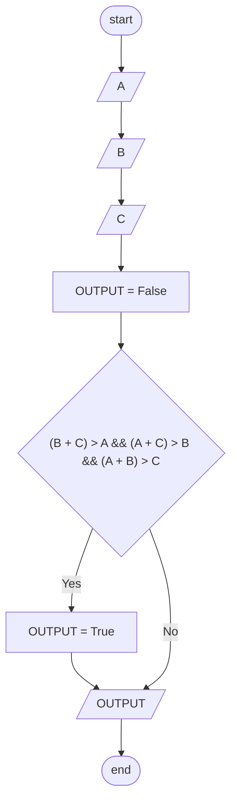
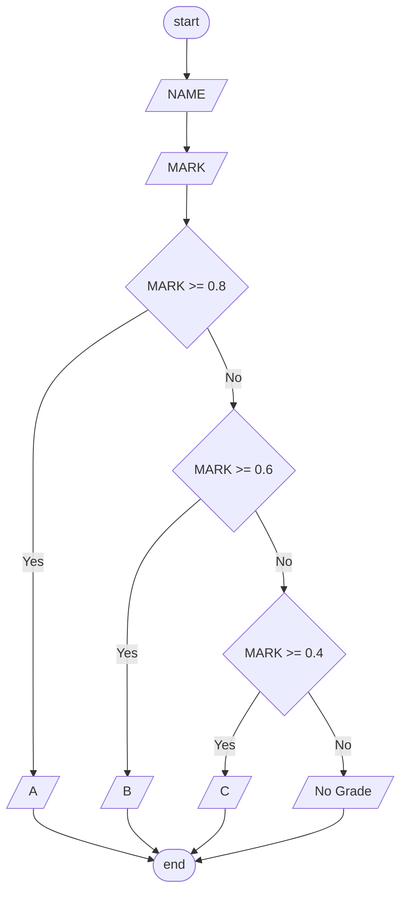

# Flowchart Exercise

## Exercise 1

### Pseudocode


```
input LFT
LCM = LFT * 30
output LCM
```

### Flowchart


## Exercise 2

### Pseudocode

```
input LENGTH
input WIDTH
AREA = L * M
output AREA
```

### Flowchart


## Exercise 3

### Pseudocode

```
BIGGEST = 0
I = 0

while
    if I == 3
        break

    INPUT = input

    if I == 0
        BIGGEST = INPUT
    else
        if INPUT > BIGGEST
            BIGGEST = INPUT
    I++

output BIGGEST
```

### Flowchart



## Exercise 4

### Pseudocode

```

input A
input B
input C

OUTPUT = False

if (B + C) > A && (A + C) > B && (A + B) > C
    OUTPUT = True

output OUTPUT
```

### Flowchart



## Exercise 5

### Flowchart


