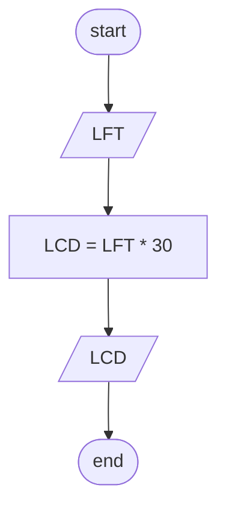

# Flowchart Exercise

## Exercise 1

### Pseudocode


```
input LFT
LCM = LFT * 30
output LCM
```

### Flowchart


```mermaid
flowchart TB
    S([start])
    I1[/LFT/]
    C1[LCD = LFT * 30]
    I2[/LCD/]
    E([end])
    S --> I1
    I1 --> C1
    C1 --> I2
    I2 --> E
```
